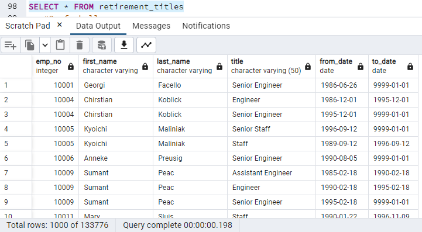
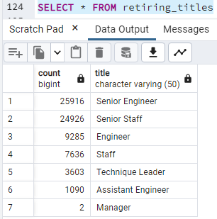
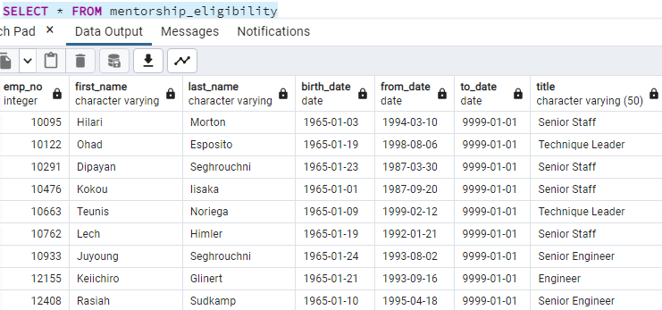

# Pewlett Hackard Employee Database Project

## Overview of the Analysis

### Purpose
In this project we are to look at the companies employee database and do some analysis on upcoming retirements to help prepare for the vacancies and provide solutions for the transition of employees.  

We will create tables in SQL to analyze the database.

## Results
For the first deliverable, we were tasked to find the employees by title who were likely to be headed to retirement in the next few years. 

* First we imported the tables from the companies csvs and loaded them into SQL. We did this by creating an ERD with primary keys and foreign keys for the tables since ultimately we would be joining tables to create our analysis.
 

* Next we inner joined the employees table and the titles table, filtered by the year the employees were born to see the titles of the likely retirees. We used SELECT DISTINCT ON to manage the duplicate entries for the multiple employee numbers and to make sure that the employees were still working for PH.

* We found the number of employees by title who were eligible to retire. 

*Next we found the mentorship eligibility of the employees so we can target the employees who could most likley be able to share their expertise with the next leaders of the company. 

## Summary of Further Analysis and Recommendations

* How many roles will need to be filled as the "silver tsunami" begins to make an impact?

There are currently 1549 employees that are eligible for the Mentorship program according to our Mentorship Eligibility table. They will tasked with helping the next generation of employees lead the company. 

According to or Retiring Titles csv, there will be 72,458 employees eligible for retirement in the near future. 
 
* Are there enough qualified, retirement-ready employees in the departments to mentor the next generation of Pewlett Hackard employees?

Depending on the programs used for mentorship, and how many employees truly need the mentorship beyond basic training, I would say that PH likely has enough employees available for mentorship roles. 

An additional table that would be helpful to create would be a table that tracked how many years an employee has been with the company. This could lead to some insight on some of the employees who are likely to step up in the wake of the "silver tsunami". 

You could also create a table that drilled down a bit closer on actual retirement dates and employees plans for retirement. You may need some additional information and insight from your employees, but that could be gained through the mentorship program and questionaires. 